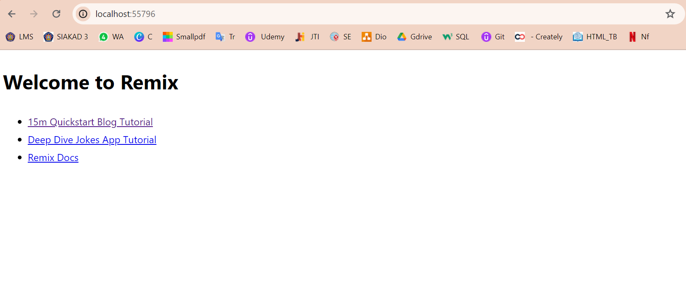
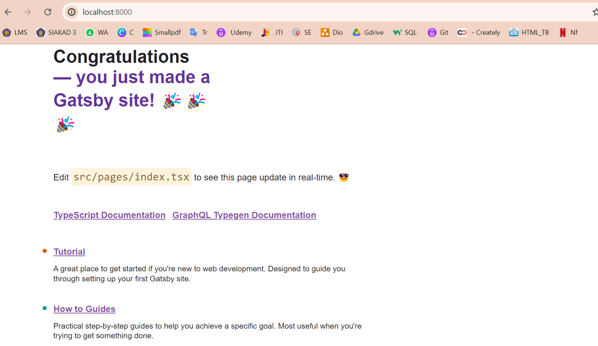
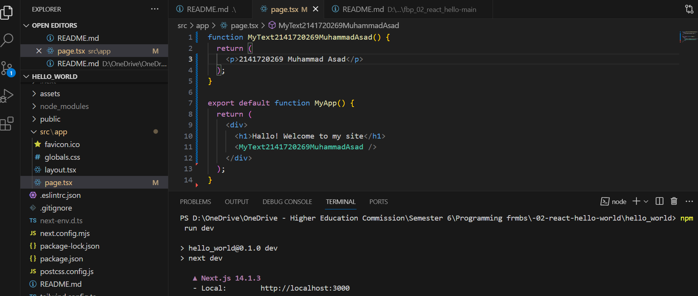
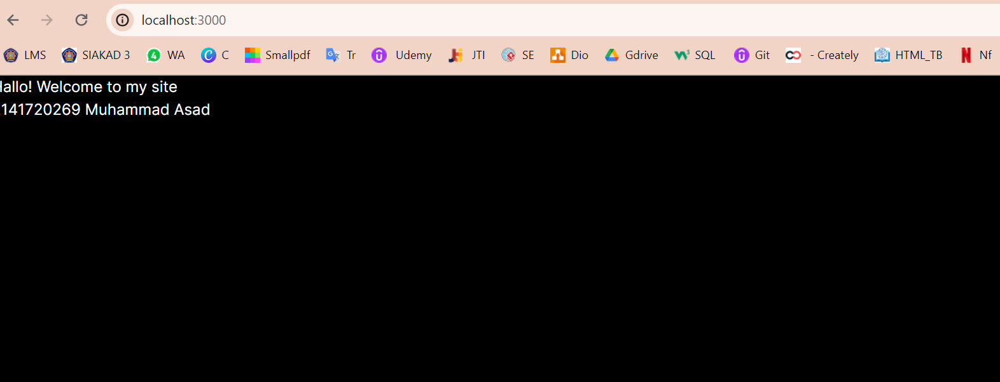
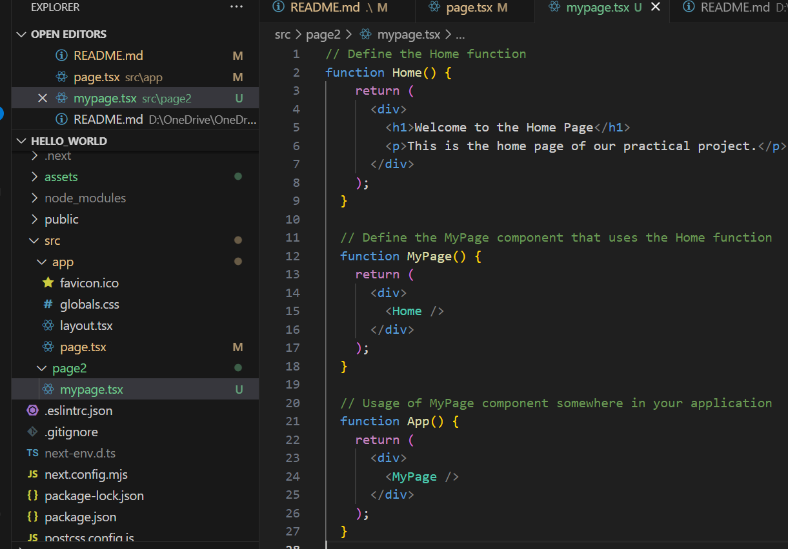
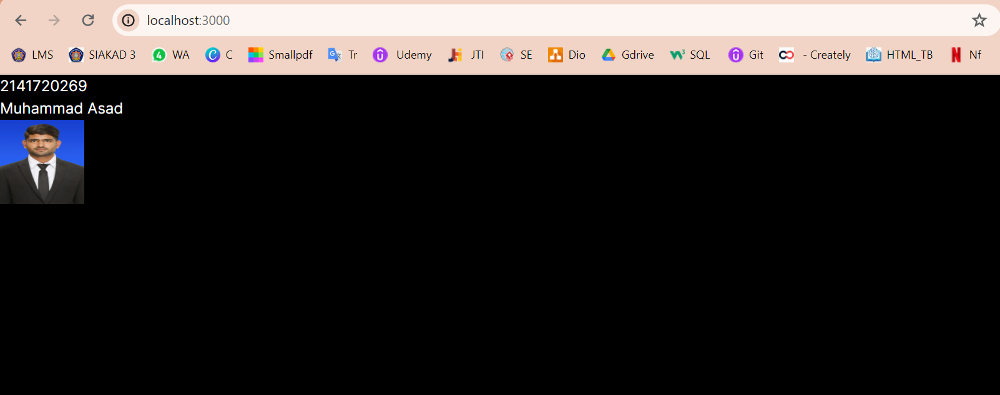

This is a [Next.js](https://nextjs.org/) project bootstrapped with [`create-next-app`](https://github.com/vercel/next.js/tree/canary/packages/create-next-app).

## Getting Started

First, run the development server:

```bash
npm run dev
# or
yarn dev
# or
pnpm dev
# or
bun dev
```
## Laporan Praktikum

|  | Pemrograman Berbasis Framework 2024 |
|--|--|
| NIM |  2141720269|
| Nama |  Muhammad Asad |
| Kelas | TI - 3I |


### Jawaban Soal 1

Bukti setup environment telah berhasil di  komputer..


## Question 2
In the project structure, explain the use of each folder and file!


## Question 3
Replace the text at the top with your Name - NIM .


## Question 3 part 2

The behavior you’re describing is known as Hot Module Replacement (HMR), which is a feature provided by many modern development servers, including the one used by Next.js. HMR enhances the development experience by updating modules in the browser at runtime without needing a full refresh. This means that when you make changes to your code, those changes can be instantly reflected in the browser without having to stop and restart the server or manually reload the page.

Here’s how it works:

1. When you run npm run dev, the development server starts, and it watches for file changes in your project.
2. If you modify a file, the development server detects the change.
3. The server then updates the changed modules on the page while preserving the application state.
4. This process happens in the background, so you see the changes immediately without a page reload.

This feature is particularly useful for preserving the state of your application during development, which can save time and improve productivity.

## 4.Practical Assignments
Try creating another React project using the Remix and Gatsby frameworks . You don't need to push this, just screenshot and explain the differences between the three frameworks (including Next.js ) in file READMEnumber 1.




## Question 4
Create a component MyTextNimName()based on the code from previous question number 3. Then call the component. Is there a change in appearance? Why is that ?
## answer
I think its because the page.tsx is importing from default function Home, while I create the function MyTextNimName and it is not in the default function. So I have to export from different function first for it to run!





## Question 5
Create a component MyPage()based on this practical project 1 which contains HTML codes for functions Home(). Then call the component. Is there a change in appearance? Why is that ?



## Question 6
Use the JSX image code, replace it with NIM, replace your name and image link with your photo (can be from a social media link or other). Push the code and screenshot the results.



Contoh perubahan.